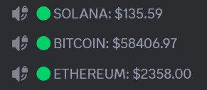
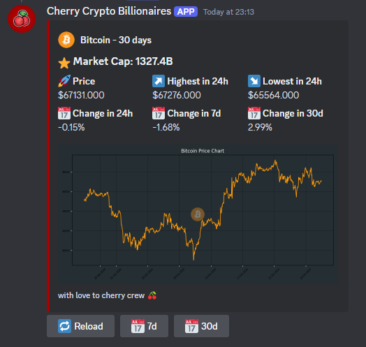
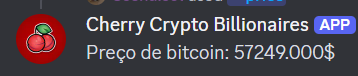
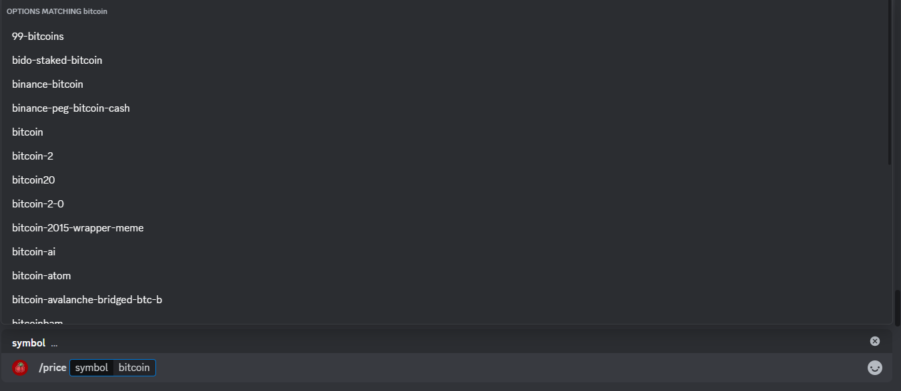
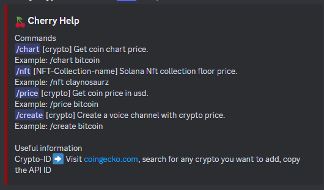
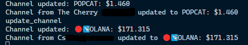

# Discord cryptocurrency price bot

> Provides cryptocurrency price information


Discord Bot Cherry is a personal project designed to fetch cryptocurrency prices from an API.

## Features

- Multi-Server Support: The bot can operate in multiple Discord servers simultaneously, providing price updates for each server.
- Get real-time cryptocurrency prices in USD.
- Fetch and display NFT collection floor prices on Solana.
- Create voice channels that display cryptocurrency price updates.
- Display price charts for specific cryptocurrencies.
- Auto complete for commands with a list of coins

```
/chart [crypto] Get coin chart price.
Example: /chart bitcoin
/nft [NFT-Collection-name] Solana Nft collection floor price.
Example: /nft claynosaurz
/price [crypto] Get coin price in usd.
Example: /price bitcoin
/create [crypto] Create a voice channel with crypto price.
Example: /create bitcoin
/help Get help
```

## Voice channels preview



## Chart



## Price



## Auto complete



## Help



## Different servers


