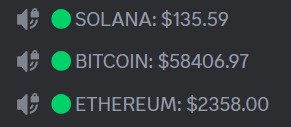
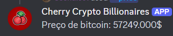

# Discord cryptocurrency price bot

> Provides cryptocurrency price information

Discord Bot Cherry is a personal project that fetches cryptocurrency prices from an API and displays them in a voice channel’s name. It responds to two commands: /price {crypto} for current crypto prices and /nft {nft-collection-name} for NFT details on the Solana blockchain. The bot features autocomplete for both commands, suggesting cryptocurrency names and top NFT collections to streamline selection.

